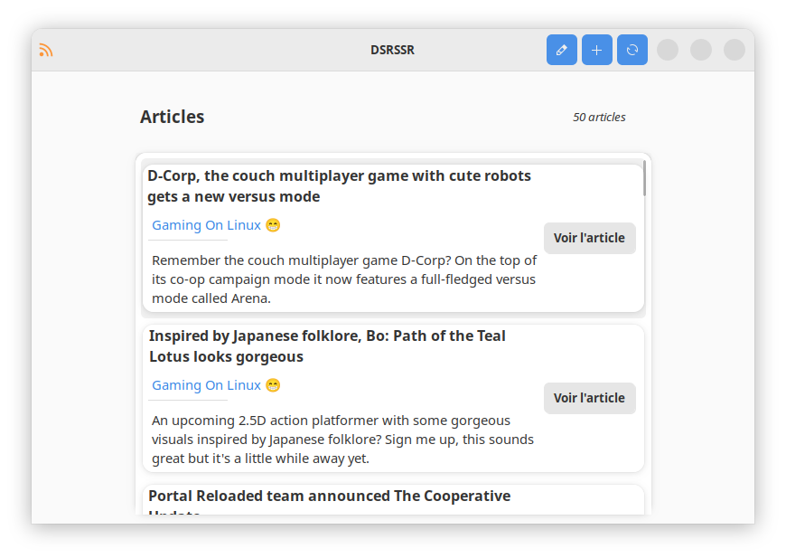
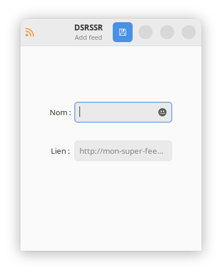
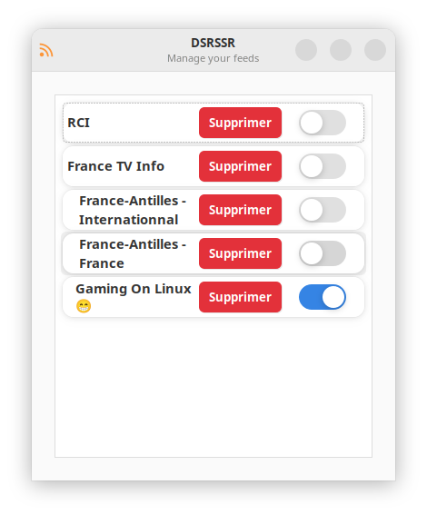

# DSRSSR - Didiloy's Simple RSS Reader
A simple RSS reader written with C# and GTK3 using the [GtkSharp](https://github.com/GtkSharp/GtkSharp) bindings

## Gallery

Homescreen : 

Add a new feed : 

Manage your feeds : 

## Installation
This app only work on Linux, you need to have GTK3 installed on your system.  
Download the  zip file from the [release page](https://github.com/Didiloy/dsrssr/releases) and extract it.
You can then run the app by double clicking on the `dsrssr` file.
Keep in mind that the 'ui' folder must be in the same directory as the executable.